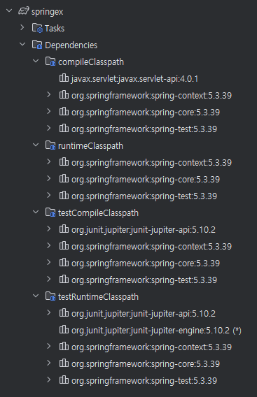
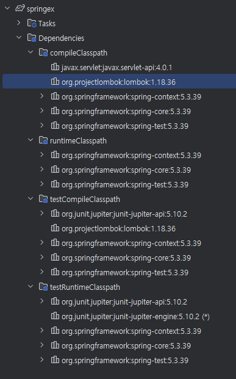

ㅇㅇ
Intellij Spring legacy project
인텔리제이로 스프링레거시프로젝트 만들기
책 실습 

Tomcat 책 9.0.59
Server 인코딩, 재시작 옵션
- VM Options: -Dfile.encoding=UTF-8
- On Update action: Update classes and resources 실제 Hot swap classes
- On frame deactivation: Update classes and resources 실제 Hot swap classes

## 프로젝트의 경로 설정 23
Tomcat 중지 후 > Edit > Deployment
1. ...war 삭제 (-)
2. \+ Artifact ..war (exploded) 지정
3. Application context: /


### 스프링 라이브러리 추가 224

책 5.3.19

#### 롬복 라이브러리 추가

책 1.18.24

#### Log4j2 라이브러리 추가

실습 01 의존성 주입하기
SampleService, SampleDAO 파일 추가

#### 설정 파일 추가
WEB-INF
new>XML COnfiguration FIle>Spring Config

```xml
<?xml version="1.0" encoding="UTF-8"?>
<beans xmlns="http://www.springframework.org/schema/beans"
       xmlns:xsi="http://www.w3.org/2001/XMLSchema-instance"
       xsi:schemaLocation="http://www.springframework.org/schema/beans http://www.springframework.org/schema/beans/spring-beans.xsd">

</beans>
```

```xml
<?xml version="1.0" encoding="UTF-8"?>
<beans xmlns="http://www.springframework.org/schema/beans"
       xmlns:xsi="http://www.w3.org/2001/XMLSchema-instance"
       xsi:schemaLocation="http://www.springframework.org/schema/beans http://www.springframework.org/schema/beans/spring-beans.xsd">

    <bean class="org.zerock.springex.sample.SampleDAO"/>
    <bean class="org.zerock.springex.sample.SampleService"/>
</beans>
```

#### 스프링의 빈 설정 테스트
```shell
10:58:41  INFO [org.zerock.springex.sample.SpringTests] org.zerock.springex.sample.SampleService@59546cfe
```


