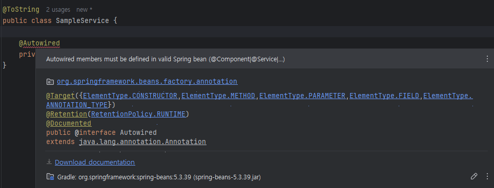

## ApplicationConxtext와 Bean
에러나지만 Spring Test는 정상




```shell
11:04:12  INFO [org.zerock.springex.sample.SpringTests] SampleService(sampleDAO=org.zerock.springex.sample.SampleDAO@153d4abb)
```
SampleService 객체안에 SampleDAO 객체가 주입된 것을 확인할 수 있음

### <context:component-scan>

```xml
<?xml version="1.0" encoding="UTF-8"?>
<beans xmlns="http://www.springframework.org/schema/beans"
       xmlns:xsi="http://www.w3.org/2001/XMLSchema-instance"
       xmlns:context="http://www.springframework.org/schema/context"
       xsi:schemaLocation="http://www.springframework.org/schema/beans http://www.springframework.org/schema/beans/spring-beans.xsd http://www.springframework.org/schema/context https://www.springframework.org/schema/context/spring-context.xsd">

    <context:component-scan base-package="org.zerock.springex.sample"/>
</beans>
```

```shell
11:11:44  INFO [org.zerock.springex.sample.SpringTests] SampleService(sampleDAO=org.zerock.springex.sample.SampleDAO@6c65860d)
```

### 생성자 주입 방식
초기 스프링에서는 @Autowired를 멤버 변수에 할당하거나
- Setter를 작성하는 방식을 많이 이용
- 스프링3 이후에는 생성자 주입 방식을 더 많이 활용

생성자 주입 방식
- 주입 받아야 하는 객체의 변수는 final로 작성
- 생성자를 이용해서 해당 변수를 생성자의 파라미터로 지정

생성자 주입방식은 객체를 생성할 때 문제가 발생하는지 미리 확인할 수 있기때문에
필드 주입이나 Setter 주입 방식보다 선호됨

Autowired


생성자 주입 방식
```java
import lombok.RequiredArgsConstructor;
import lombok.ToString;
import org.springframework.stereotype.Service;

@Service
@ToString
@RequiredArgsConstructor
public class SampleService {
    
    private final SampleDAO sampleDAO;
}
```

