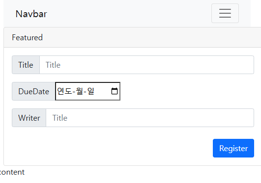
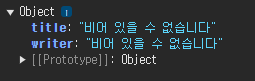
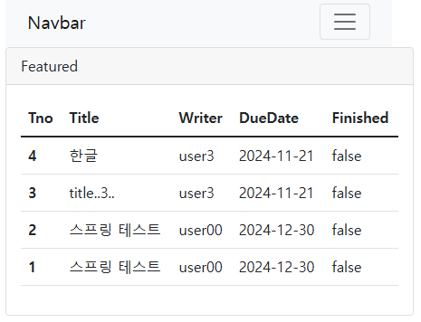

# 4.4. 스프링 Web MVC 구현하기 291
## 프로젝트의 구현 목표와 준비
### 프로젝트의 준비
DTO와 VO의 변환을 위한 ModelMapper

```groovy
    implementation 'org.modelmapper:modelmapper:3.2.1'
    implementation 'org.hibernate.validator:hibernate-validator:8.0.1.Final'
```
책 3.0.0, 6.2.1.Final

### 프로젝트의 폴더/패키지 구조 293
Sample 파일들 삭제

## 화면 디자인 - 부트스트랩 적용 296
https://getbootstrap.com/docs/5.1/getting-started/introduction/#starter-template

http://localhost:8080/resources/test.html

### 부트스트랩의 container, row 적용 298

```shell
03:52:31  INFO [org.zerock.springex.mapper.TodoMapperTests] 2024-11-20 15:52:31
```

SQL 실행로그 자세히
INFO > TRACE
```xml
        <logger name="org.zerock.springex.mapper" level="TRACE" additivity="false">
            <appender-ref ref="console" />
        </logger>
```

```shell
03:55:00 DEBUG [org.zerock.springex.mapper.TimeMapper2.getNow] ==>  Preparing: select now()
03:55:00 DEBUG [org.zerock.springex.mapper.TimeMapper2.getNow] ==> Parameters: 
03:55:00 TRACE [org.zerock.springex.mapper.TimeMapper2.getNow] <==    Columns: now()
03:55:00 TRACE [org.zerock.springex.mapper.TimeMapper2.getNow] <==        Row: 2024-11-20 15:55:00
03:55:00 DEBUG [org.zerock.springex.mapper.TimeMapper2.getNow] <==      Total: 1
03:55:00  INFO [org.zerock.springex.mapper.TimeMapperTests] 2024-11-20 15:55:00
```

## Todo 기능 개발 308
### TodoMapper 개발 및 테스트
[TodoMapperTests.java](../src/test/java/org/zerock/springex/mapper/TodoMapperTests.java)
```java
    @Test
    public void insert() {
        TodoVO todoVO = TodoVO.builder()
                .title("스프링 테스트")
                .dueDate(LocalDate.of(2024,12,30))
                .writer("user00")
                .build();
        todoMapper.insert(todoVO);
    }
```
```shell
03:59:04 DEBUG [org.zerock.springex.mapper.TodoMapper.insert] ==>  Preparing: insert into tbl_todo (title, dueDate, writer) values (?, ?, ?)
03:59:04 DEBUG [org.zerock.springex.mapper.TodoMapper.insert] ==> Parameters: 스프링 테스트(String), 2024-12-30(LocalDate), user00(String)
03:59:04 DEBUG [org.zerock.springex.mapper.TodoMapper.insert] <==    Updates: 1
```

## TodoService test
```shell
04:06:39  INFO [org.zerock.springex.service.TodoServiceImpl] org.modelmapper.ModelMapper@183ade54
04:06:39  INFO [org.zerock.springex.service.TodoServiceImpl] TodoVO(tno=null, title=스프링 테스트, dueDate=2024-12-30, finished=false, writer=user00)
04:06:39 DEBUG [org.zerock.springex.mapper.TodoMapper.insert] ==>  Preparing: insert into tbl_todo (title, dueDate, writer) values (?, ?, ?)
04:06:39 DEBUG [org.zerock.springex.mapper.TodoMapper.insert] ==> Parameters: 스프링 테스트(String), 2024-12-30(LocalDate), user00(String)
04:06:39 DEBUG [org.zerock.springex.mapper.TodoMapper.insert] <==    Updates: 1
```

### TodoController의 GET/POST 처리 313
http://localhost:8080/todo/register




#### post 방식의 처리 315
```shell
04:23:15  INFO [org.zerock.springex.controller.TodoController] POST register
04:23:15  INFO [org.zerock.springex.controller.TodoController] TodoDTO(tno=null, title=스프링 테스트, dueDate=2024-11-21, finished=false, writer=user11)
```
### 한글 처리를 위한 filter설정 317
[web.xml](../src/main/webapp/WEB-INF/web.xml)
```shell
TodoDTO(tno=null, title=스프링 테스트, dueDate=2024-11-22, finished=false, writer=user11)
```

### @Valid를 이용한 서버사이드 검증 318
7버전부터는 jakarta 패키지를 쓰는 문제로 제한이 있으므로
책 6.2.1.Final
```groovy
implementation 'org.hibernate.validator:hibernate-validator:6.2.5.Final'
```

#### TodoDTO 검증하기 320
```java
package org.zerock.springex.dto;

import javax.validation.constraints.Future;
import javax.validation.constraints.NotEmpty;
import lombok.*;

import java.time.LocalDate;

@ToString
@Data
@Builder
@AllArgsConstructor
@NoArgsConstructor
public class TodoDTO {
    private Long tno;

    @NotEmpty
    private String title;

    @Future
    private LocalDate dueDate;

    private boolean finished;

    @NotEmpty
    private String writer;
}
```

[TodoController.java](../src/main/java/org/zerock/springex/controller/TodoController.java)
POST 방식때 이를 반영하도록 BindingResult와 @Valid 어노테이션 적용
```shell
04:55:10  INFO [org.zerock.springex.controller.TodoController] has errors
```

#### JSP에서 검증 에러 메시지 확인하기 322
```html
                    <script>
                        const serverValidResult = {};
                        
                        console.log(serverValidResult);
                    </script>
```

```html
                    <script>
                        const serverValidResult = {};
                        
                            serverValidResult['writer'] = '비어 있을 수 없습니다';
                        
                            serverValidResult['title'] = '비어 있을 수 없습니다';
                        
                        console.log(serverValidResult);
                    </script>
```

dueDate 날짜를 과거로 선택
{dueDate: '미래 날짜여야 합니다'}

## Todo 등록 기능 완성 325
[TodoController.java](../src/main/java/org/zerock/springex/controller/TodoController.java) 
```java
todoService.register(todoDTO);
```
## Todo 목록 기능 개발 326
#### TodoMapper의 개발
가장 최근에 등록된 TodoVO가 나오는 selectAll() 추가

[TodoMapper.java](../src/main/java/org/zerock/springex/mapper/TodoMapper.java)
```shell
05:10:31 DEBUG [org.zerock.springex.mapper.TodoMapper.selectAll] ==>  Preparing: select * from tbl_todo order by tno desc
05:10:31 DEBUG [org.zerock.springex.mapper.TodoMapper.selectAll] ==> Parameters: 
05:10:31 TRACE [org.zerock.springex.mapper.TodoMapper.selectAll] <==    Columns: tno, title, dueDate, writer, finished
05:10:31 TRACE [org.zerock.springex.mapper.TodoMapper.selectAll] <==        Row: 4, 한글, 2024-11-21, user3, 0
05:10:31 TRACE [org.zerock.springex.mapper.TodoMapper.selectAll] <==        Row: 3, title..3.., 2024-11-21, user3, 0
05:10:31 TRACE [org.zerock.springex.mapper.TodoMapper.selectAll] <==        Row: 2, 스프링 테스트, 2024-12-30, user00, 0
05:10:31 TRACE [org.zerock.springex.mapper.TodoMapper.selectAll] <==        Row: 1, 스프링 테스트, 2024-12-30, user00, 0
05:10:31 DEBUG [org.zerock.springex.mapper.TodoMapper.selectAll] <==      Total: 4
05:10:31  INFO [org.zerock.springex.mapper.TodoMapperTests] TodoVO(tno=4, title=한글, dueDate=2024-11-21, finished=false, writer=user3)
05:10:31  INFO [org.zerock.springex.mapper.TodoMapperTests] TodoVO(tno=3, title=title..3.., dueDate=2024-11-21, finished=false, writer=user3)
05:10:31  INFO [org.zerock.springex.mapper.TodoMapperTests] TodoVO(tno=2, title=스프링 테스트, dueDate=2024-12-30, finished=false, writer=user00)
05:10:31  INFO [org.zerock.springex.mapper.TodoMapperTests] TodoVO(tno=1, title=스프링 테스트, dueDate=2024-12-30, finished=false, writer=user00)
```


### 조회
```shell
05:22:25 DEBUG [org.zerock.springex.mapper.TodoMapper.selectOne] ==>  Preparing: select * from tbl_todo where tno = ?
05:22:25 DEBUG [org.zerock.springex.mapper.TodoMapper.selectOne] ==> Parameters: 1(Long)
05:22:25 TRACE [org.zerock.springex.mapper.TodoMapper.selectOne] <==    Columns: tno, title, dueDate, writer, finished
05:22:25 TRACE [org.zerock.springex.mapper.TodoMapper.selectOne] <==        Row: 1, 스프링 테스트, 2024-12-30, user00, 0
05:22:25 DEBUG [org.zerock.springex.mapper.TodoMapper.selectOne] <==      Total: 1
05:22:25  INFO [org.zerock.springex.mapper.TodoMapperTests] TodoVO(tno=1, title=스프링 테스트, dueDate=2024-12-30, finished=false, writer=user00)
```

